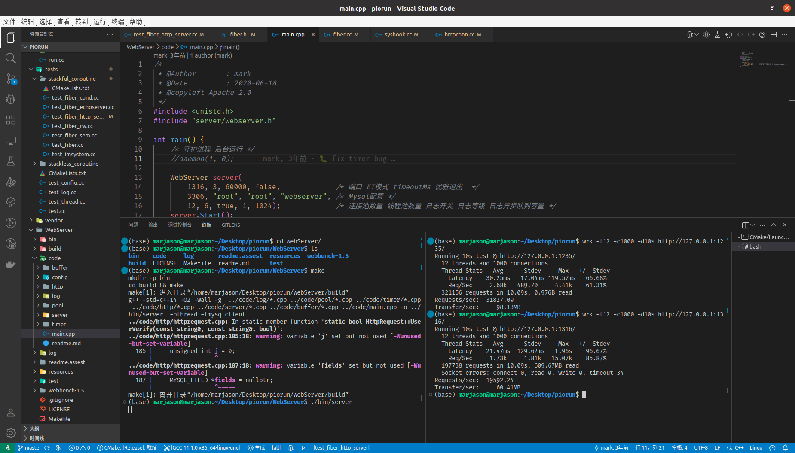

# piorun - a high performance and elegant http server

## Environment

1. clang-format >= 15.0.0: sudo apt install clang-format-15
2. Visual Studio Code

## Pressure test
piorun vs webserver: CPU: 16, CORE: 32
piorun: qps 30000+
webserver: qps 18000+

## Reference

[sylar](https://github.com/sylar-yin/sylar)
