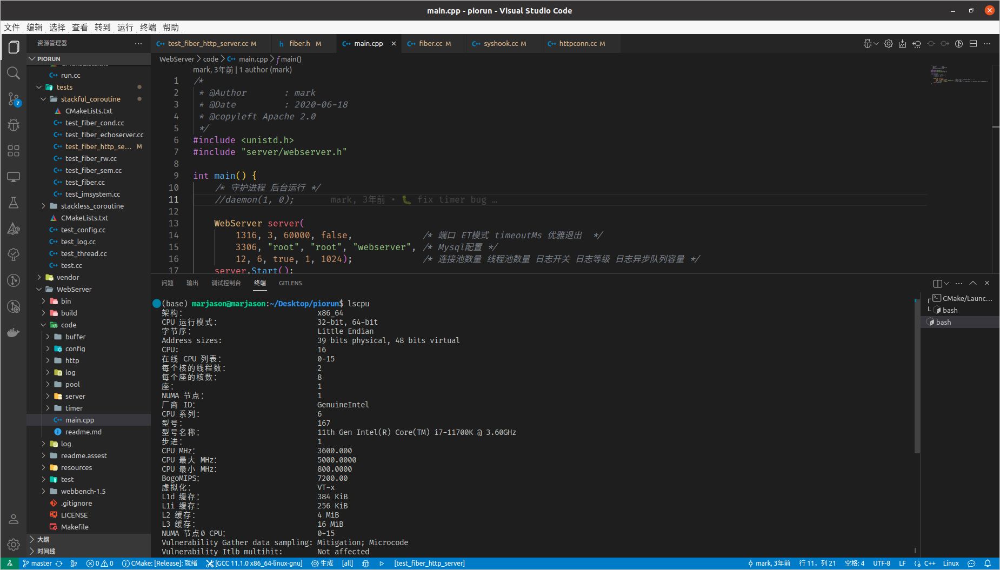

# piorun - a high performance and elegant http server

## Environment

1. clang-format >= 15.0.0: sudo apt install clang-format-15
2. Visual Studio Code

## Pressure test
piorun:

webserver:

## Reference

[sylar](https://github.com/sylar-yin/sylar)
