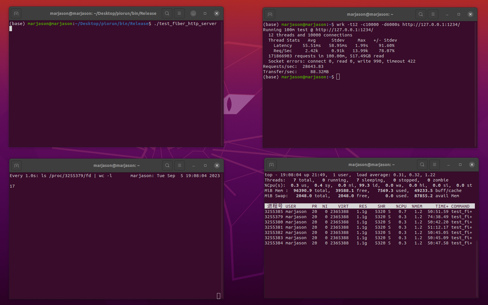

#### 压力测试报告

- 硬件环境

    

- 对比服务器: Webserver: https://github.com/markparticle/WebServer

- 控制变量: 二版服务器均关闭日志,总线程数量均为7,实现完全相同的http服务,其他条件均保持一致

- 服务器开启后,进行100min wrk压测, 接着保持服务器运行, 继续进行 10min webbench压测

#### wrk测试

- piorun

```sh
ulimit -SHn 102400
wrk -t12 -c10000 -d6000s http://127.0.0.1:1234/
./webbench -c 10000 -t 600 http://127.0.0.1:1234/
```





- Webserver

```sh
ulimit -SHn 102400
wrk -t12 -c10000 -d6000s http://127.0.0.1:1316/
./webbench -c 10000 -t 600 http://127.0.0.1:1316/
```

    - Webserver 在 wrk测试结束后崩了(可能代码有问题,我们仅更改了main函数:将日志功能关闭)


#### 性能对比

| | piorun | Webserver |
| --- | --- | --- |
| wrk(100min):QPS | 28643 | 20879 |
| wrk(100min):Latency: average | 55.51ms | 18.17ms |
| wrk(100min):Latency: stdev | 58.95ms | 70.48ms |
| wrk(100min):Latency: max | 1.99s | 2.00s |
| wrk(100min):socket error: connect | 0 | 0 |
| wrk(100min):socket error: read | 0 | 10038 |
| wrk(100min):socket error: write | 990 | 149844 |
| wrk(100min):socket error: timeout | 422 | 89494 |

| | piorun | Webserver |
| --- | --- | --- |
| webbench(10min):QPS | 37128 | 40743 |
| webbench(10min):error | 217 | 635 |

#### 内存泄漏检查:

- 安装最新版本:valgrind

```sh
wget https://sourceware.org/pub/valgrind/valgrind-3.21.0.tar.bz2
tar -xvf valgrind-3.21.0.tar.bz2
cd valgrind-3.21.0/
./configure
make
sudo make install
```

- 修改test_fiber_http_server.cc中的HttpServer函数(目的是使得服务器60s后退出),编译debug版本piorun

```cpp
// 修改stop变量的定义为原子类型
std::atomic<int> stop = 0;

// 修改HttpServer函数
void HttpServer() {
  int listenfd = CreateTcpSocket(1234, "127.0.0.1");
  SetNonBlock(listenfd);
  listen(listenfd, 1024);

  assert(listenfd >= 0);

  while (!stop) {
    sockaddr_in addr;
    socklen_t len = sizeof(addr);

    int clifd = accept(listenfd, (sockaddr *)&addr, &len);

    go [] {
      pio::this_fiber::sleep_for(std::chrono::seconds(60));
      stop = 1;
    };

    if (clifd < 0) {
      // 因为listenfd是非阻塞的，如果accept失败，使用poll监视listenfd是否有新连接可accept.
      // 这里不能使用epoll，使用libco后用户不能随意使用epoll.
      struct pollfd pf = {0};
      pf.fd = listenfd;
      pf.events = (POLLIN | POLLERR | POLLHUP);
      poll(&pf, 1, 1000);
      continue;
    } else {
      char buf[32];
      memset(buf, 0, 32);
      inet_ntop(AF_INET, &addr.sin_addr, buf, 32);
    }

    go[clifd, addr] {
      HttpConn conn = HttpConn();
      conn.init(clifd, addr);
      timeval timeout;
      timeout.tv_sec = 60;
      timeout.tv_usec = 0;
      setsockopt(clifd, SOL_SOCKET, SO_RCVTIMEO, &timeout, sizeof(timeout));
      do {
        do {
          int ret = -1;
          int readErrno = 0;
          ret = conn.read(&readErrno);
          // printf("ret=%d\n", ret);
          if (ret <= 0 && readErrno != EAGAIN) {
            conn.Close();
            return;
          }
        } while (!conn.process());
        do {
          int ret = -1;
          int writeErrno = 0;
          ret = conn.write(&writeErrno);
          if (ret <= 0 && writeErrno != EAGAIN) {
            conn.Close();
            return;
          }
        } while (conn.ToWriteBytes() != 0);

      } while (conn.IsKeepAlive());

      conn.Close();
    };
  }

  close(listenfd);
}
```

- 使用valgrind启动服务器,并新建终端进行40s压力测试

```sh
valgrind --leak-check=full --show-leak-kinds=all ./test_fiber_http_server
```

```sh
wrk -t12 -c1000 -d40s http://127.0.0.1:1234/
```

```
==3467883== Memcheck, a memory error detector
==3467883== Copyright (C) 2002-2022, and GNU GPL'd, by Julian Seward et al.
==3467883== Using Valgrind-3.21.0 and LibVEX; rerun with -h for copyright info
==3467883== Command: ./test_fiber_http_server
==3467883== 
==3467883== Warning: client switching stacks?  SP change: 0x1ffefff738 --> 0x8e630c0
==3467883==          to suppress, use: --max-stackframe=137272870520 or greater
==3467883== Warning: client switching stacks?  SP change: 0x651e528 --> 0x9921490
==3467883==          to suppress, use: --max-stackframe=54538088 or greater
==3467883== Warning: client switching stacks?  SP change: 0x99212d8 --> 0x651e528
==3467883==          to suppress, use: --max-stackframe=54537648 or greater
==3467883==          further instances of this message will not be shown.
==3467883== 
==3467883== HEAP SUMMARY:
==3467883==     in use at exit: 0 bytes in 0 blocks
==3467883==   total heap usage: 3,373,149 allocs, 3,373,149 frees, 245,880,349 bytes allocated
==3467883== 
==3467883== All heap blocks were freed -- no leaks are possible
==3467883== 
==3467883== For lists of detected and suppressed errors, rerun with: -s
==3467883== ERROR SUMMARY: 0 errors from 0 contexts (suppressed: 0 from 0)
```
