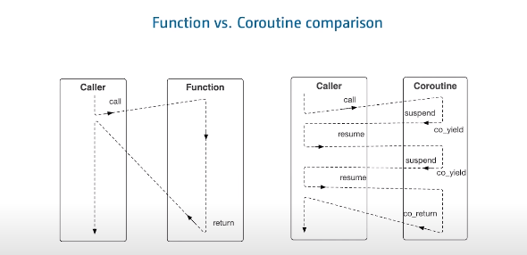

# 无栈协程



协程有两种形式：Stackfill and Stackless

C++ 20 实现的是无栈协程，其中的数据(coroutine frame)存储在堆上。

## Keywords

A coroutine is any function that contains a `co_return`, `co_yield` or `co_await`.

|  关键字   |  作用  | 状态      |
| :-------: | :----: | :-------- |
| co_yield  | output | suspended |
| co_return | output | ended     |
| co_await  | input  | suspended |

- **co_yield 和 co_await 使协程处于挂起状态**
- **当我们想在协程执行中间为协程指定不同的入参，我们可以使用 _co_await_。**
- **co_return 能够结束协程的执行**

## 组成元素

In C++, a coroutine consists of:

- A wrapper type. This is the return type of the coroutine function's prototype.
- The compiler looks for a type with the exact name `promise_type` inside the return type of the coroutine (the wrapper type).
- An awaitable type that comes into play once we use `co_await`.

A coroutine in C++ is an finite state machine (FSM) that can be controlled and customized by the `promise_type`.

## Task vs Generator

- Task is A coroutine that does a job without returning a value (withour co_yield or co_return, maybe only co_await).
- Generator is A coroutine that does a job and returns a value (either by co_return or co_yield).

## Awaiter

`co_await` 后跟一个等待器，它需要定义以下成员函数：

- `await_ready`: if `await_ready` returns false, it means that an await expression always suspends as it waits for its value, else it means that an await expression never suspends.
- `await_suspend`: 指定协程挂起时的行为，接收 `std::coroutine_handle<>` 为参数
- `await_resume`: 在协程被恢复（resume）时调用的函数

```cpp
struct awaitable {
    bool await_ready();
    // one of:
    void await_suspend(std::coroutine_handle<>) {}
    bool await_suspend(std::coroutine_handle<>) {}
    std::coroutine_handle<>
        await_suspend(std::coroutine_handle<>) {}
    void await_resume() {}
};
```

## Functions of promise_type

- `initial_suspend`: 指定协程在启动时是否应挂起
- `final_suspend`: 指定协程在完成时是否应挂起
- `get_return_object`: 指定函数返回的数据类型
- `unhandled_exception`: 指定协程发生异常时的行为
- `yield_value`: 对应于 `co_yield xxx`，相当于 `co_await promise.yield_value(xxx)`
- `return_value`: 对应于 `co_return xxx`
- `return_void`: 对应于 `co_return`
- `await_transform`: 对应于 `co_await xxx`，不过我认为一般用上面的 awaiter 就可以了

## co_await task 流程

1. 执行 await_ready，如果返回 false，则执行步骤 2
2. 执行 await_suspend，参数为当前 handler，返回想要跳转到的 handler
3. 转移所有权到 handler（就是上一步的返回值）
4. ...
5. 执行 promise_type.final_suspend
6. 执行 await_resume

## 调度器设计

通过 emitter 注册事件，失败的事件不会卡死，而会添加到 emitter 之中，每个 emitter 中保存一个事件队列，通过 scheduler resolve 事件，从而实现在协程中同时运行服务器和客户端。

这样，不会使服务端和客户端处于死循环状态，而是会形成如下的函数链。

server.accept() -> client.connect() -> server.accept() -> client.write() -> server.read() -> ...

从而，使得二者可以在一个线程（多个协程）上同时执行服务端和客户端。

## Reference

- <https://itnext.io/c-20-coroutines-complete-guide-7c3fc08db89d>
